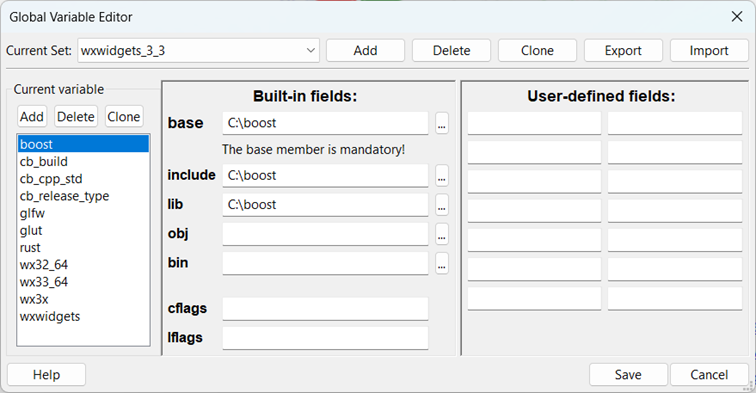
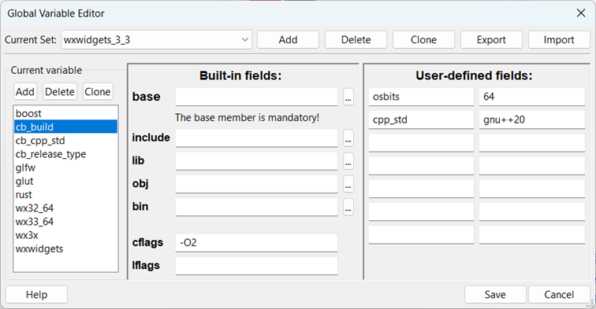
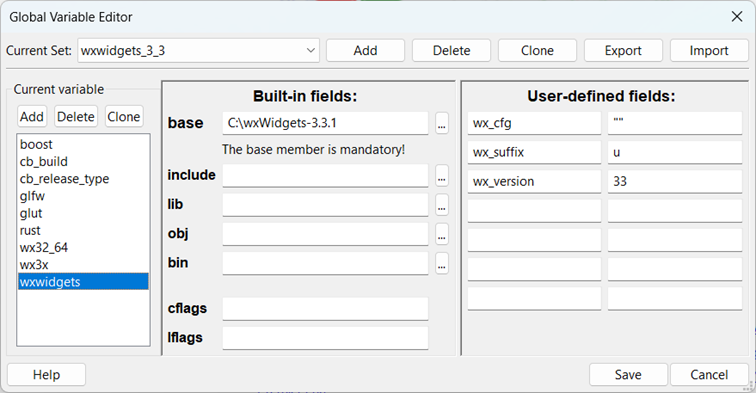

The current set, here wxwidgets_3_3, is defined by cloning the default one, then modifying it. Don't forget to save the result!

cb_build **base** is defined but not used here in \*\_windows.cbp versions. You can define it as "" (to set an empty string, **but do not set to blank**). You can also define it with the full path to codeblocks/src, for me it's: D:\\Users\\Gerard\\Documents\\CodeBlocks_SVN\\CodeBlocks_src\\src. It may be used for plugins where the full path is needed.

cb_build **cflags** **must be defined**. Here, it is -O2. You can also define it with -g. If you don't want to set it, don't set it to a blank field, but, as for the base field, define it as "".

cb_release_type is defined for wx31_64 cbps, **but not used with \_windows versions** and is equivalent to cb_build.cflags

To be compatible with standard cbp versions (as \*wx32_64.cbp), use cpp_std with gnu++11 as value (instead of gnu++20).

As configured here, it is compatible with standard versions, Andrew Cottrell's old/new versions and mine.

**How to use them**:

Load in a usable Code::Blocks executable (for example an official version or a nightly) the workspace CodeBlocks_Windows.workspace. It contains all links to the \*\_Windows.cbp. If necessary, C::B will ask you to set some global variables if they have not been set previously.

**Make a full generation the first time you use it**.

At the end, use the updateWindows.bat file to create a working stripped version in the corresponding outputxx_yy. xx is equal to wx_version and yy to osbits. With parameters given in previous images, it will be output33_64.

**updateWindows.bat is always created by Codeblocks_Windows.cbp**.

Note that if you create a version for other wxWidgets versions, you'll have simply to modify the global variables.